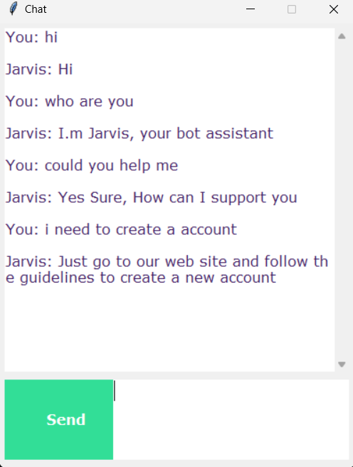

# Chatbot using NLTK and Keras

This repository contains a simple chatbot implemented using NLTK for natural language processing and Keras for training a neural network model. The chatbot uses intents defined in a JSON file to generate responses.

## Introduction
This project demonstrates how to create a simple chatbot that can respond to user inputs based on predefined intents. The chatbot uses NLTK for tokenizing and lemmatizing the input text, and Keras to train a neural network for predicting the appropriate response.

## Features
- Tokenization and lemmatization of input text
- Neural network model for intent classification
- Randomized responses based on predicted intent
- Simple GUI for interacting with the chatbot using Tkinter

## Preview


## Installation
1. Clone the repository:
    ```sh
    git clone https://github.com/your-username/chatbot-nltk-keras.git
    ```
2. Navigate to the project directory:
    ```sh
    cd chatbot-nltk-keras
    ```
3. Install the required dependencies:
    ```sh
    pip install -r requirements.txt
    ```

## Usage
1. Ensure you have the required NLTK data files:
    ```python
    import nltk
    nltk.download('punkt')
    nltk.download('wordnet')
    ```
2. Run the chatbot script:
    ```sh
    python chatbot.py
    ```

## Training the Model
If you need to retrain the model with new intents or data, follow these steps:
1. Ensure your `intents.json` file is updated with the new data.
2. Run the training script:
    ```sh
    python train.py
    ```

## Running the Chatbot
After training the model, you can run the chatbot with a simple GUI:
1. Ensure the trained model file (`chatbot_model.h5`), `words.pkl`, `classes.pkl`, and `intents.json` are in the project directory.
2. Execute the chatbot script:
    ```sh
    python chatbot.py
    ```

## File Descriptions
- `chatbot.py`: The main script to run the chatbot with a Tkinter GUI.
- `train.py`: The script to train the neural network model.
- `intents.json`: The JSON file containing the intents and corresponding patterns and responses.
- `chatbot_model.h5`: The trained model file.
- `words.pkl`: Pickle file containing the vocabulary.
- `classes.pkl`: Pickle file containing the intents.
- `requirements.txt`: File listing the required Python packages.

## Dependencies
- Python 3.x
- NLTK
- Keras
- TensorFlow
- Tkinter (for the GUI)

